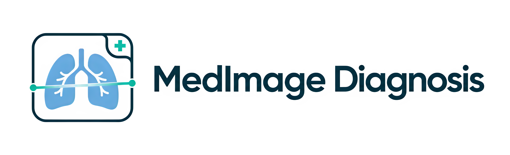
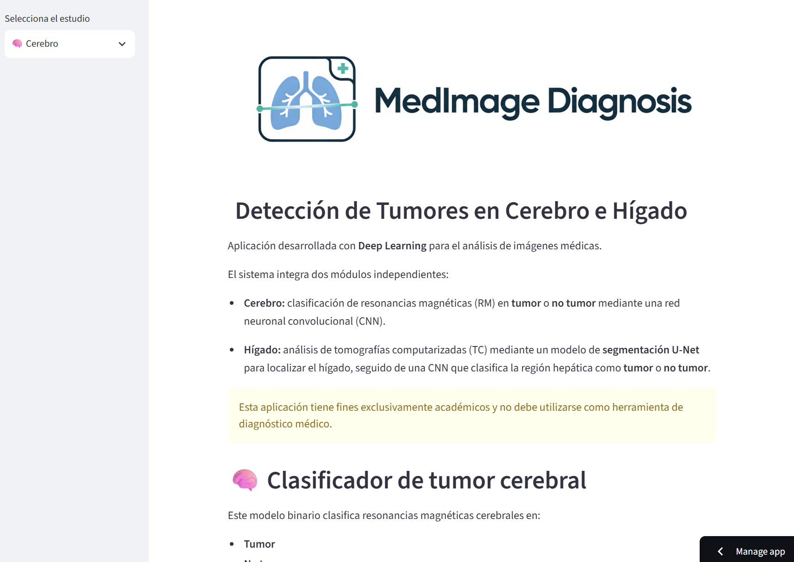
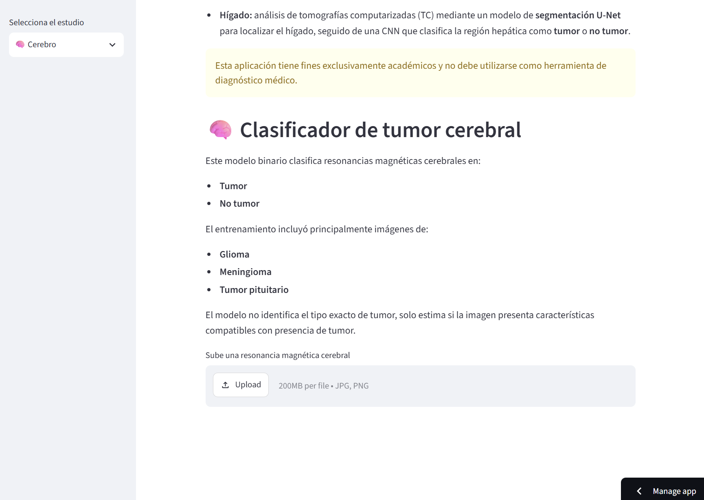
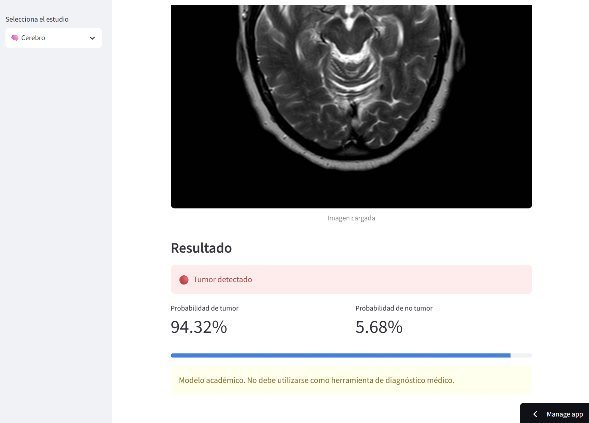
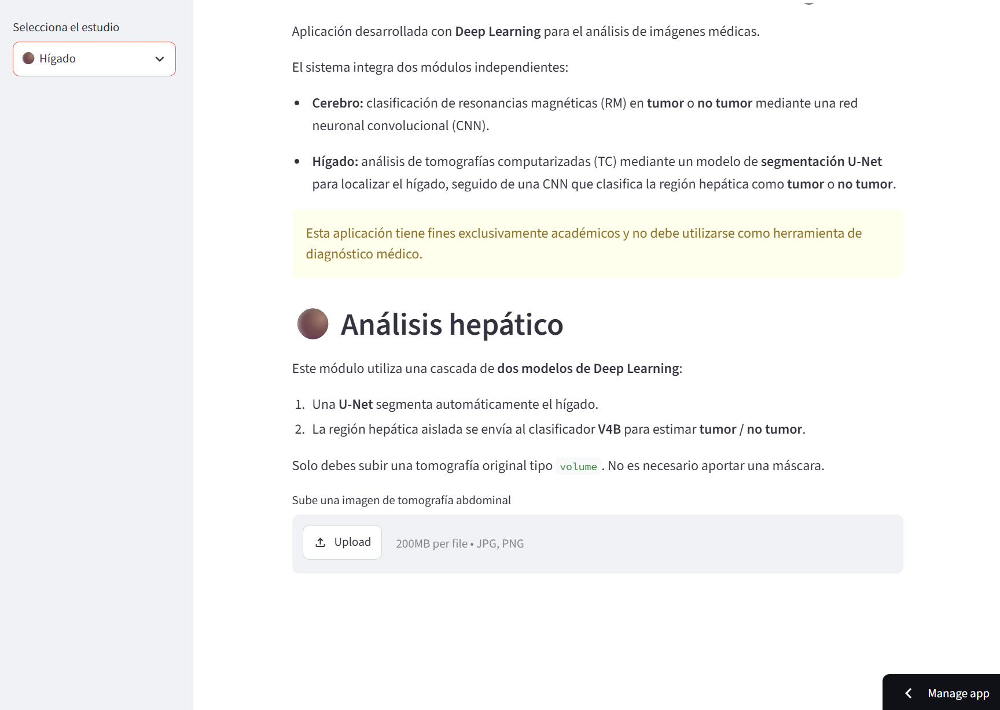
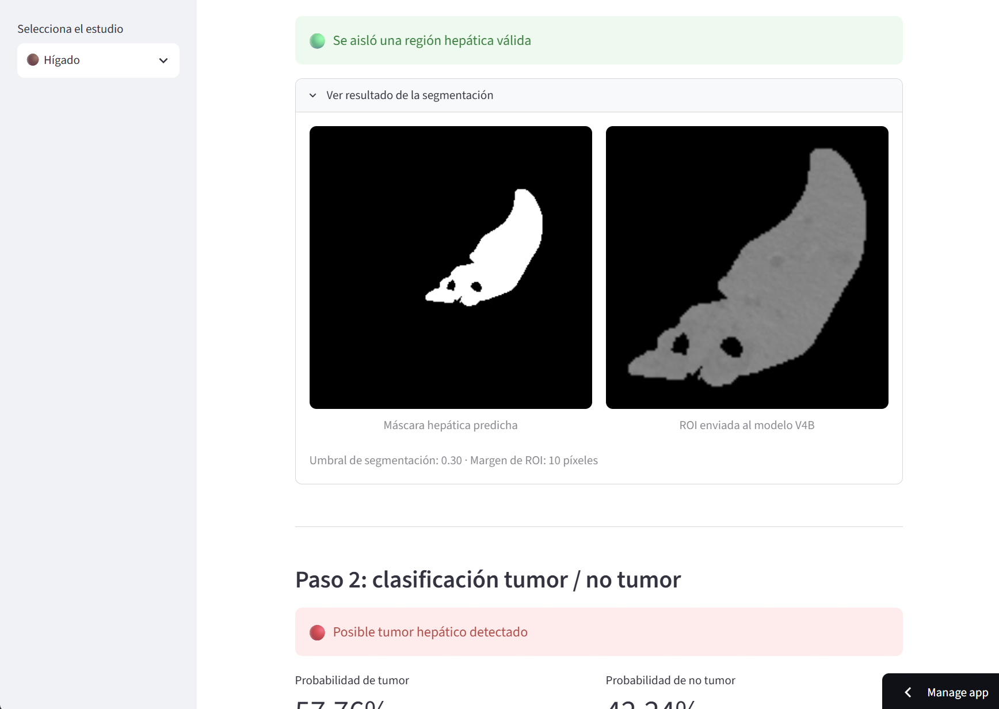
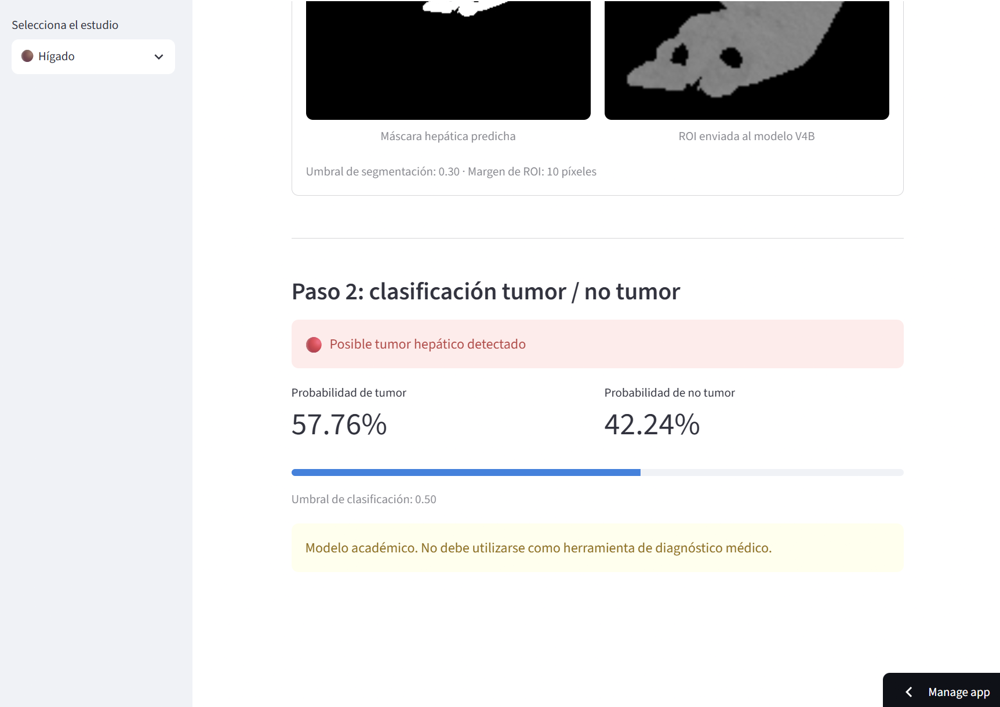
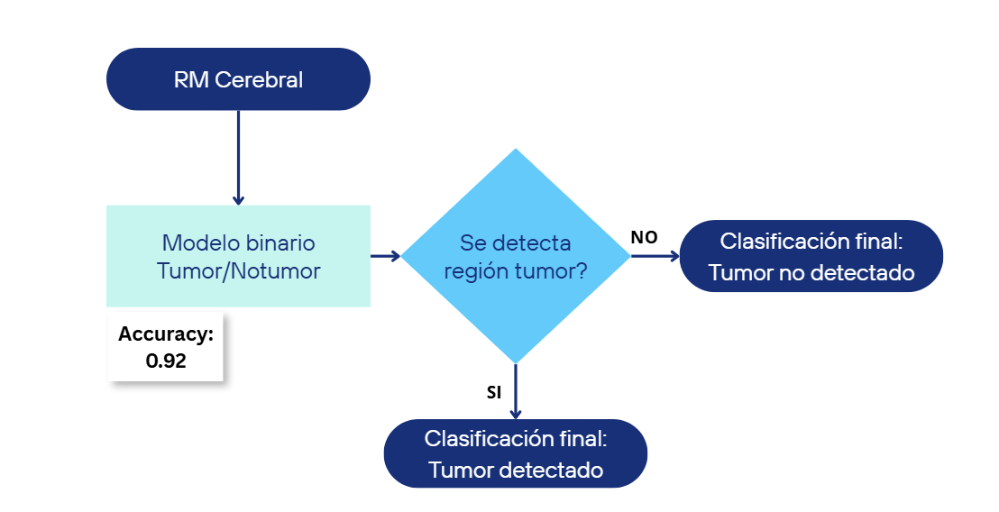
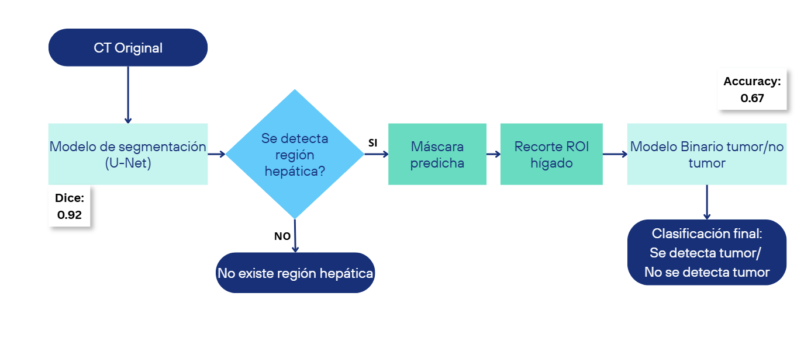

<p align="center">
  
</p>

# 🩺 MedImage Diagnosis: Brain & Liver Tumor Detection
<a>

</a>
<a>

</a>
<p align="center">

<a href="https://machine-learning-pythonproyectofinalvmelissahm-h2zooaso9fgqr6z.streamlit.app/">

</a>

<a href="https://github.com/melissahm/machine-learning-python_proyecto_final_vmelissahm">

</a>

</p> 
<p align="center">
Aplicación de Deep Learning para el análisis de resonancias magnéticas cerebrales y tomografías computarizadas abdominales.
</p>

Sistema basado en **Deep Learning** para la detección automática de tumores en imágenes médicas de cerebro e hígado.

La aplicación integra dos módulos desarrollados de forma independiente:

- 🧠 Clasificación binaria de tumores cerebrales mediante resonancias magnéticas (RM).
- 🟤 Detección de tumores hepáticos mediante una arquitectura en cascada basada en segmentación U-Net y una CNN de clasificación.

Este proyecto se presenta mediante una aplicación web construida con **Streamlit**, que permite realizar inferencias sobre imágenes médicas de forma interactiva.

<p align="center">

</p>

## 📑 Índice

- Introducción
- Características
- Vista previa
- Funcionamiento del modelo cerebral
- Funcionamiento del modelo hepático
- Datasets
- Resultados
- Tecnologías utilizadas
- Instalación y ejecución
- Descarga de los modelos
- Estructura del proyecto
- Limitaciones
- Trabajo futuro
- Aviso médico
- Autora

## Introducción

El diagnóstico por imagen constituye una de las principales herramientas utilizadas en medicina para la detección y seguimiento de múltiples enfermedades. Sin embargo, tanto las resonancias magnéticas como las tomografías computarizadas generan estudios compuestos por cientos de cortes bidimensionales que deben ser analizados manualmente por especialistas.

Este proyecto explora el uso de técnicas de **Deep Learning** para asistir en la identificación automática de tumores en dos escenarios clínicos distintos:

- Tumores cerebrales mediante resonancias magnéticas (RM).
- Tumores hepáticos mediante tomografías computarizadas (TC).

Para ello se desarrollaron dos pipelines independientes que posteriormente fueron integrados en una aplicación web desarrollada con Streamlit.

## Características

- Clasificación binaria de resonancias magnéticas cerebrales.
- Segmentación automática del hígado mediante U-Net.
- Clasificación binaria de tumores hepáticos.
- Aplicación web desarrollada con Streamlit.
- Descarga automática de modelos desde Google Drive.
- Predicción en tiempo real sobre imágenes médicas.

## 🖥️ Vista previa

### 🧠 Clasificador de tumor cerebral

Interfaz principal del módulo de clasificación.

<p align="center">
  
</p>

Resultado de una predicción.
<p align="center">
  
</p>

### 🟤 Análisis hepático

Interfaz principal del módulo de clasificación.

<p align="center">
  
</p>

Segmentación de la región hepática.

<p align="center">
  
</p>

Resultado de una predicción.

<p align="center">
  
</p>


## 🧠 Funcionamiento del modelo cerebral

El modelo recibe como entrada un corte bidimensional de una resonancia magnética cerebral previamente preprocesado.

Tras el proceso de inferencia, la CNN estima la probabilidad de que la imagen pertenezca a una de las dos clases:

- Tumor
- No tumor

<p align="center">
  
</p>

## 🟤 Funcionamiento del modelo hepático

El módulo hepático implementa una arquitectura en cascada compuesta por dos modelos de Deep Learning.

En primer lugar, una red U-Net segmenta automáticamente el hígado sobre la tomografía computarizada. Posteriormente, la región hepática aislada se envía a un clasificador CNN binario encargado de estimar la presencia o ausencia de tumor.

<p align="center">
  
</p>


---

## 📚 Datasets

### 🧠 Dataset de resonancias magnéticas cerebrales

El dataset original está compuesto por aproximadamente **7.200 imágenes de resonancia magnética cerebral**, distribuidas en cuatro categorías:

- Glioma
- Meningioma
- Tumor pituitario
- No tumor

Para transformar el problema en una clasificación binaria, las clases se agruparon de la siguiente manera:

```text
Tumor    = glioma + meningioma + tumor pituitario
No tumor = no tumor
```

Con el objetivo de trabajar con clases balanceadas, se seleccionó un subconjunto de **3.600 imágenes**:

| Conjunto | No tumor | Tumor | Total |
|---|---:|---:|---:|
| Entrenamiento | 1.400 | 1.400 | 2.800 |
| Test | 400 | 400 | 800 |
| **Total utilizado** | **1.800** | **1.800** | **3.600** |

La clase `Tumor` incluye muestras de los tres tipos originales, buscando mantener una representación equilibrada:

- Entrenamiento: 466 gliomas, 466 meningiomas y 468 tumores pituitarios.
- Test: 133 gliomas, 133 meningiomas y 134 tumores pituitarios.

---

### 🟤 Dataset de tomografías hepáticas

El módulo hepático utiliza imágenes de tomografía computarizada abdominal procedentes de estudios volumétricos.

El dataset contiene:

| Elemento | Cantidad |
|---|---:|
| Pacientes o volúmenes | 131 |
| Imágenes CT originales | 58.638 |
| Máscaras de hígado | 58.638 |
| Máscaras de tumor | 58.638 |

Cada estudio volumétrico está compuesto por múltiples cortes axiales bidimensionales. Para evitar fuga de información entre los conjuntos, la separación de entrenamiento y validación se realizó por paciente.

#### Datos utilizados por el clasificador hepático V4B

| Conjunto | No tumor | Tumor | Total |
|---|---:|---:|---:|
| Entrenamiento | 7.396 | 4.368 | 11.764 |
| Validación | 1.762 | 1.285 | 3.047 |
| **Entrenamiento + validación** | **9.158** | **5.653** | **14.811** |

Adicionalmente, se utilizaron **4.332 imágenes de test**, alcanzando un total de **19.143 imágenes** consideradas en el desarrollo y evaluación del pipeline.

No existen pacientes repetidos entre entrenamiento y validación.

#### Datos utilizados por el modelo de segmentación

| Conjunto | Imágenes |
|---|---:|
| Entrenamiento | 12.157 |
| Validación | 2.654 |
| Test | 4.332 |
| **Total** | **19.143** |

---

## 📊 Resultados

### Resumen de métricas

| Módulo | Métrica principal | Resultado |
|---|---|---:|
| Clasificador cerebral | Accuracy | **0,92** |
| Segmentación hepática U-Net | Dice Score | **0,92** |
| Clasificador hepático V4B | Accuracy | **0,67** |

> Las métricas corresponden a modelos académicos desarrollados con fines educativos y no representan una validación clínica.

---

### 🧠 Resultados del clasificador cerebral

El modelo binario de cerebro alcanzó una **accuracy del 92 %** sobre un conjunto de test balanceado de 800 imágenes.

| Clase | Precision | Recall | F1-score | Soporte |
|---|---:|---:|---:|---:|
| No tumor | 0,88 | 0,96 | 0,92 | 400 |
| Tumor | 0,96 | 0,86 | 0,91 | 400 |
| **Promedio ponderado** | **0,92** | **0,92** | **0,91** | **800** |

El modelo obtuvo una **accuracy del 92 %** sobre un conjunto de test balanceado de 800 imágenes.

Los resultados muestran una elevada capacidad para diferenciar entre imágenes con presencia de tumor y aquellas sin evidencia tumoral, constituyendo una base sólida para aplicaciones académicas de apoyo al diagnóstico.


---

### 🟤 Resultados de la segmentación hepática

El modelo U-Net alcanzó un **Dice Score de 0,92** en la segmentación automática del hígado.

Esta segmentación permite:

1. Localizar la región hepática.
2. Generar una máscara binaria.
3. Extraer una región de interés o ROI.
4. Enviar únicamente la región hepática al clasificador de tumor.

El resultado final del pipeline depende de la calidad de la segmentación, ya que una máscara imprecisa puede afectar al recorte y a la clasificación posterior.

---

### 🟤 Resultados del clasificador hepático V4B

El clasificador hepático obtuvo una **accuracy del 67 %**.

| Clase | Precision | Recall | F1-score | Soporte |
|---|---:|---:|---:|---:|
| No tumor | 0,79 | 0,68 | 0,73 | 2.871 |
| Tumor | 0,50 | 0,64 | 0,56 | 1.461 |
| **Promedio ponderado** | **0,69** | **0,67** | **0,67** | **4.332** |

El modelo presenta un mejor desempeño global sobre la clase `No tumor`, mientras que la detección de tumor sigue siendo el principal punto de mejora.

---

## 🛠️ Tecnologías utilizadas

### Lenguaje y análisis de datos

- Python
- NumPy
- Pandas
- Matplotlib
- Scikit-learn

### Deep Learning y procesamiento de imágenes

- TensorFlow
- Keras
- OpenCV
- Pillow
- Redes neuronales convolucionales
- U-Net
- Segmentación semántica

### Aplicación y despliegue

- Streamlit
- Google Drive
- gdown
- Git
- GitHub
- GitHub Codespaces

---

## 🚀 Instalación y ejecución

### 1. Clonar el repositorio

```bash
git clone https://github.com/melissahm/machine-learning-python_proyecto_final_vmelissahm.git
cd machine-learning-python_proyecto_final_vmelissahm
```

### 2. Crear un entorno virtual

```bash
python -m venv .venv
```

#### Windows

```bash
.venv\Scripts\activate
```

#### Linux o macOS

```bash
source .venv/bin/activate
```

### 3. Instalar las dependencias

```bash
pip install -r requirements.txt
```

### 4. Ejecutar la aplicación

```bash
streamlit run src/app.py
```

La aplicación se abrirá automáticamente en el navegador.

---

## 🤖 Descarga de los modelos

Los archivos de los modelos no se almacenan directamente en el repositorio debido a su tamaño.

La descarga se realiza únicamente la primera vez que se ejecuta la aplicación. Posteriormente, los modelos quedan almacenados de forma local para evitar nuevas descargas.

Los modelos incluidos en el pipeline son:

- Clasificador binario de cerebro.
- Modelo U-Net para segmentación hepática.
- Clasificador hepático V4B.

La descarga se gestiona desde los módulos de carga incluidos en el proyecto, por lo que el usuario no necesita descargar manualmente los archivos.

---

## 📂 Estructura del proyecto

```text
.
├── assets/
│   ├── diagrams/
│   │   ├── diagrama_cerebro.png
│   │   └── diagrama_higado.png
│   ├── screenshots/
│   │   ├── home_streamlit.png
│   │   ├── streamlit_cerebro.png
│   │   ├── streamlit_cerebro_result.png
│   │   ├── streamlit_higado.png
│   │   ├── streamlit_higado_carga.png
│   │   ├── streamlit_higado_segmentacion.png
│   │   └── streamlit_higado_result.png
│   ├── brain.png
│   ├── liver.png
│   └── logo.png
├── data/
│   ├── interim/
│   ├── processed/
│   ├── raw/
│   └── test_images/
├── models/
├── src/
│   ├── organ_apps/
│   │   ├── cerebro_app.py
│   │   └── higado_app.py
│   ├── utils/
│   └── app.py
├── .gitignore
├── README.es.md
├── README.md
└── requirements.txt
```

### Componentes principales

- `src/app.py`: punto de entrada de la aplicación Streamlit.
- `src/organ_apps/cerebro_app.py`: interfaz e inferencia del módulo cerebral.
- `src/organ_apps/higado_app.py`: segmentación e inferencia del módulo hepático.
- `src/utils/`: funciones auxiliares para carga de modelos y preprocesamiento.
- `assets/`: logo, diagramas y capturas utilizadas en la documentación.
- `data/test_images/`: imágenes de ejemplo para probar la aplicación.
- `models/`: carpeta destinada a los modelos descargados.

---

## ⚠️ Limitaciones

### Modelo cerebral

- Realiza una clasificación binaria y no identifica el tipo específico de tumor.
- Analiza cortes bidimensionales de manera independiente.
- No localiza espacialmente el tumor.
- Su rendimiento puede variar con imágenes procedentes de otros hospitales, equipos o protocolos de resonancia.

### Modelo hepático

- La clasificación depende de la calidad de la segmentación previa.
- Los cortes extremos del volumen pueden contener una región hepática muy pequeña o inexistente.
- Las lesiones hepáticas presentan formas, tamaños y densidades heterogéneas.
- El rendimiento del clasificador V4B evidencia margen de mejora antes de considerar aplicaciones más exigentes.

---

## 🔮 Trabajo futuro

### Cerebro

- Extender el modelo a clasificación multiclase:
  - Glioma.
  - Meningioma.
  - Tumor pituitario.
  - No tumor.
- Entrenar con imágenes procedentes de diferentes hospitales y equipos de resonancia.
- Incorporar técnicas de interpretabilidad como Grad-CAM y mapas de calor.
- Evaluar arquitecturas que aprovechen información tridimensional.

### Hígado

- Incorporar un mayor número de pacientes.
- Optimizar el modelo de segmentación y el clasificador binario.
- Evaluar lesiones hepáticas más complejas.
- Mejorar el comportamiento en cortes extremos.
- Analizar volúmenes completos en lugar de cortes 2D independientes.

---

## 🩺 Aviso médico

Este proyecto es un prototipo académico desarrollado con fines educativos.

**No es un dispositivo médico certificado y no debe utilizarse para realizar diagnósticos, recomendar tratamientos o tomar decisiones clínicas.**

Los resultados deben ser interpretados únicamente como predicciones experimentales de modelos de Deep Learning.

---

## 👩‍💻 Autora

**Melissa Huamán**

Data scientist

<p align="left">
  <a href="https://github.com/melissahm">
    
  </a>
</p>

<p align="right">
  <a href="README.md">English version</a>
</p>